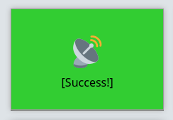
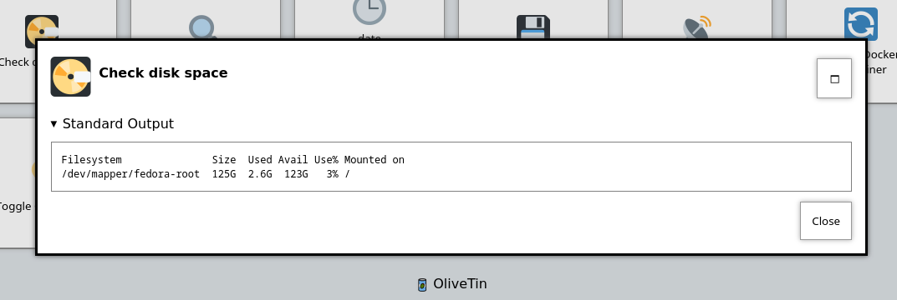
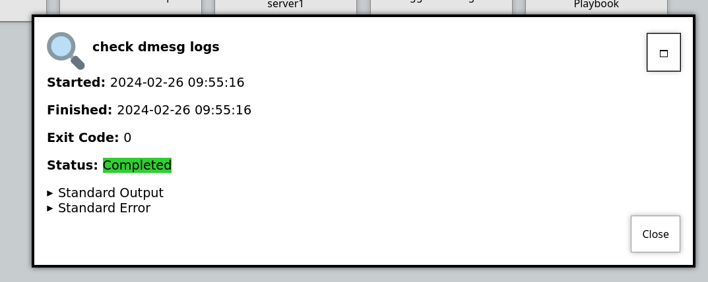
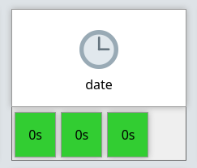
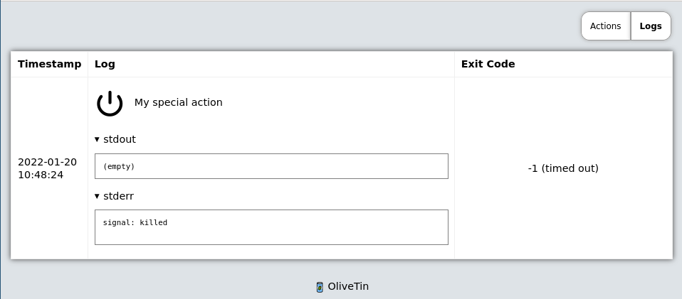
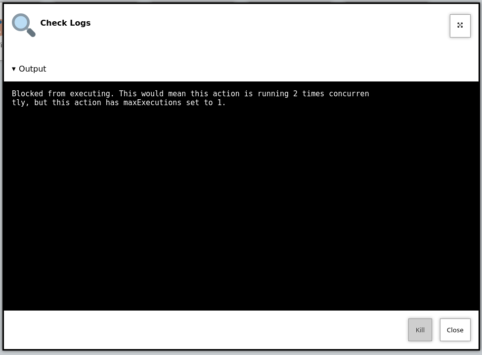

[#action-customisation]
== Action customisation

=== Execution Feedback
OliveTin now has several options to control "feedback" when actions are started. This can be controlled on
a per-action basis, using the `popupOnStart` configuration option.

==== Big Flashy Buttons

[source,yaml]
.`config.yaml`
----
actions:
  - title: Ping the Internet
    popupOnStart: default
----

This will also be the option that is used if no other values match.

==== Execution Dialog (Output Only)

[source,yaml]
.`config.yaml`
----
actions:
  - title: Check disk space
    popupOnStart: execution-dialog-stdout-only
----

==== Execution Dialog

[source,yaml]
.`config.yaml`
----
actions:
  - title: Check dmesg logs
    popupOnStart: execution-dialog
----

.Example of `popupOnStart: execution-dialog`

==== Execution Buttons

[source,yaml]
.`config.yaml`
----
actions:
  - title: date
    popupOnStart: execution-button
----

[#icons]
=== Icons

You can specify any HTML for an icon. It's a popular choice to use Unicode
icons because they are extremely fast to load and there are a lot of them.

Version 2024.03.06 also introduced support for Iconify, built in to OliveTin.

.Examples of icons in OliveTin
image::images/exampleIcons.png[]

==== Iconify Icons

Browse over 200,000 icons that can be used with OliveTin here; https://icon-sets.iconify.design/

Note, the icons are loaded from the internet, but should be cached by your browser afer the first load.

On the Iconfiy website, you should select **Iconify Icon**

image::images/iconify.png[]

Then copy this icon code, and place it in your config;

[source,yaml]
.`config.yaml`
----
actions:
  - title: Iconify Icon
    icon: <iconify-icon icon="ant-design:bug-filled"></iconify-icon>
----

And you should get something that looks like this;

image::images/action-button-iconify.png[]

==== Unicode icons ("emoji")

For example on the link:https://symbl.cc/en/emoji/[here is a list of
"Emoji" in unicode]. If you find "link:https://symbl.cc/en/1F60E/[Smiling face with sunglasses]" you can click 
on it to see it's "HTML-code". In OliveTin, you'd setup the icon like this;

----
actions:
  - title: Unicode (emoji) icon
    icon: "&#128526;"
    shell: echo "You are awesome"
----

==== Full HTML icons (`'
      shell: docker ps
----

NOTE: This full HTML thing is very customizable, but easier options will
probably be added in the future as well. 

==== Saving and serving icons for "offline" use

Sometimes you might want to store images to use as icons, with your installation of OliveTin. This can be useful when your installation is meant to be offline, or disconnected from the internet. This is easily done.

You should put icons in a new `customIcons` directory, inside the standard webui directory. The webui directory could be in a few different locations:

* If you installed OliveTin with a package, this directory is normally `/var/www/olivetin` on Linux. Create the directory `/var/www/olivetin/customIcons/`.
* If you installed OliveTin with a Linux Container, it's probably best to bind mount a new volume into the container. 

  `docker create jamesread/OliveTin --name OliveTin -v /opt/OliveTinIcons:/var/www/olivetin/customIcons ...`

Once you've created this `customIcons` directory. Place your icon, for example `mrgreen.gif` into this custom icon directory. Below is a picture of Mr Green. Feel free to save his likeness and awesomeness for yourself, for future awesome offline usage.

.Mr Green, the original awesome smily.
image::images/mrgreen.gif[Mr Green]

In your OliveTin config, customize your command again using HTML, like this;

----
actions:
    - title: Mr Green
      icon: ''
      shell: echo "I don't like the word 'emoji' "
----

This will result in a locally hosted icon that will work offline, that looks like this;

image::images/mrGreenAction.png[]

////
=== CSS styles

OliveTin allows you to write any CSS style rules directly on a single action.
This is both pretty powerful if you want an action to have a particular style,
but it does require understanding that you are writing your code - and can
break things! Be careful!

A tutorial on how to use CSS can easily be found online, but here are some
examples;

==== Example: Bold & Purple action

----
- actions:
    - title: My special action
      css:
        background-color: purple
        font-weight: bold
      shell: echo "I like purple"
----
////

[#timeout]
=== Timeouts

By default, actions in OliveTin have a 3 second timeout. This means that
OliveTin will kill the action if it is running for too long. 

You can set your own timeouts like this;

----
- actions:
  - title: My special action
    shell: sleep 5
    timeout: 10
----

NOTE: Allowing commands to run for infinity just doesn't seem to make sense, or
at least is probably a bad case for OliveTin. Therefore, if you set a timeout
*less than 3 seconds*, OliveTin will overwrite your Timeout and default to 3
seconds. If you think you have a use case where a shorter (or infinite) timeout
makes sense, please open an issue and let's discuss.

==== Check the logs

If a action really does "time out", it will show in the logs with "(timed out)" next to the exist code;

=== Run as different users

OliveTin does not *need* to run as root. It does not request any special
permissions from the operating system that require root (as long as you run on
ports above 1024, and it can read/write it's configuration). So, you can run as
any non-root user if you wish.

However, it is very convenient to run as root, as many users will need to run 
actions and jobs that do require root permissions. 

There are no ways in OliveTin to specify which user runs an action, because the
Linux OS has several great ways to do this already, and adding support for it
in OliveTin just adds bloat when there are perfectly good ways that already
exist.

==== EG: Using sudo;

----
actions:
  - title: Run echo as a different user
    shell: sudo -u bob echo "I am Bob."
----

If you are worried about security, you could run OliveTin as a non-privileged
user, and use sudo rules to control what it can and cannot do. 

[#concurrency]
=== Concurrency

By default, OliveTin will allow you to run several instances of an action at the same time. For example, an action might take 20 seconds, and if you click the button 3 times, for a time there will be 3 actions running at the same time.

Sometimes you don't want to allow this - an example case where it would not make sense is in the case of a backup script. To stop this, we can set `maxConcurrent` to `1`. 

[source,yaml]
----
actions:
  - title: Run Backup Script
    icon: backup
    shell: /opt/backupScript.sh
    maxConcurrent: 1
----

If you try and run a 2nd instance of this action while the first is currently running, you'll get a "blocked" message that looks like this;

Additionally, OliveTin will log a message that looks like this;

[source,log]
.OliveTin log showing an action being blocked rom running.
----
INFO Action requested                              actionTitle="Run backup script"
WARN Blocked from executing. This would mean this action is running 2 times concurrently, but this action has maxExecutions set to 1.  actionTitle="Run backup script"
----

Naturally, you can set `maxConcurrent` to `3` or some other number, to limit the amount of times the action executes at once.

[#ratelimits]
=== Rate limiting

By default, OliveTin allows you to execute actions as fast as you can click the button. This is fine if you are running OliveTin with trusted users in a trusted environment, but otherwise you may want to rate limit actions.

Rate limiting is implemented like this;

[source,yaml]
.`config.yaml`
----
actions:
  # This is the most simple action, it just runs the command and flashes the
  # button to indicate status.
  #
  # If you are running OliveTin in a container remember to pass through the
  # docker socket! https://docs.olivetin.app/action-container-control.html
  - title: date
    shell: date
    icon: clock
    maxRate:
      - limit: 3
        duration: 5m
----

[#action-ids]
=== IDs

OliveTin actions do not require IDs to be specified in the `config.yaml`, as most users of OliveTin start off with the Web Interface. However, if you want to use OliveTin actions via the <<api,API>>, then you will need to set your action IDs manually.

NOTE: OliveTin will automatically generate a new ID for actions every time it starts up, for actions that don't have an `id:` property set.

[source,yaml]
----
actions:
  - title: Start the reactor
    id: start_reactor
    shell: /bin/startReactor.sh
----

