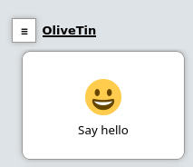

[#actions]
== Action execution

An action is a shell command, with an associated icon, and various details that describe how the command can be executed. Actions are the fundamental unit of work in OliveTin.

[#create-your-first-action]
=== Create your first action

This is an example of your very first action. First of all, edit your config.yaml, and enter this YAML markup;

.config.yaml
[source,yaml]
----
actions:
  - title: Say hello
    shell: echo "Hello!"
    icon: smile
----

If OliveTin is running, it should popup on your dashboard like this; 

Simply click on the button to execute the shell command. You can expand the executions to view the logs.

==== What do I try next?

* See a list of <<examples,example actions>>.
* <<action-customisation,Customize>> the action icon, timeout, etc.
* <<exec-cron,Execute on a schedule (cron)>>
* <<exec-startup,Execute on startup>>
* <<exec-webhook,Execute on webhook>>
* <<exec-file-created,Execute on file created>>
* <<exec-file-changed,Execute on file changed>>

[#exec-on-demand]
=== Execute on demand

This is the default, meaning that the action shows up on a dashboard, and at the moment cannot be changed.

[#exec-cron]
=== Execute on schedule (cron)

OliveTin can execute actions on a schedule, and uses a cron format for configuration.

[source,yaml]
.`config.yaml`
----
actions:
  - title: Say hello
    shell: echo "Hello!"
    execOnCron: 
      - "@hourly"

  - title: Say goodbye
    shell: echo "Say Goodbye"
    execOnCron:
      - "*/5 * * * *" # Every 5 minutes
----

This is a fantastic website: https://cron.help/

==== Support for seconds in cron

The default cron format for OliveTin supports the Unix/Linux format - 5 fields, with no support for seconds. This is by far the most popular format that most people are used to.

If you need per-second resolution for your actions, this can be enabled in your config - meaning that your cronlines will support 6 columns. The first "new" column is seconds. For example, to execute `date` every 5 seconds;

[source,yaml]
.`config.yaml`
----
cronSupportForSeconds: true

actions:
  title: Execute every 5 seconds
  shell: date
  execOnCron:
    - "*/5 * * * * *"
----

[#exec-startup]
=== Execute on startup

OliveTin can execute actions on a startup. 

----
actions:
  - title: Say hello
    shell: echo "Hello!"
    execOnStartup: true 
----

[#dnf-startup]
==== Example: Install additional commands into OliveTin

This functionality to execute actions on startup is a very easy way to install additional commands in OliveTin;

----
actions:
  - title: Install dnsmasq
    shell: microdnf install bind-utils
    execOnStartup: true
----

To learn more about how to install additional packages into the container, see <<container-dnf,installing extra container packages>>.

[#exec-webhook]
=== Execute on webhook

"Webhooks" are nothing more and a name for a type of REST API call, typically using the HTTP POST method. This is already what OliveTin uses to drive it's web interface - specifically the `StartAction` API call.

include::api_start_action_overview.adoc[]

For examples of how to use all of these functions, check out the <<api-start-action,Start Action API reference>>.

[#exec-file-created]
=== Execute on file created

You can execute an action when a file is created in a directory. The argument `filename` is pre-populated for you.

[source,yaml]
----
actions:
  - title: Print names of new files
    shell: echo {{ filename }}
    execOnCreatedInDir:
      - /home/user/Downloads/
----

[#exec-file-changed]
=== Execute on file changed

You can execute an action when a file is changed in a directory. The argument `filename` is pre-populated for you.

[source,yaml]
----
actions:
  - title: Print names of new files
    shell: echo {{ filename }}
    execOnFileChangedInDir:
      - /home/user/Downloads/
----

[#exec-on-calendar]
=== Execute on calendar file

NOTE: The feature is currently experimental. 

Sometimes you want to schedule an action to run at a specific date and time, like at 2024-02-07 at 15:30. This is technically called "an instant", and OliveTin can watch a file that contains a list of instants for new additions. 

[source,yaml]
.`start-server-calendar.yaml`
----
- 2024-03-08T20:11:45+00:00
- 2024-03-08T20:12:30+00:00
----

OliveTin will watch this file, and also load it on startup. If an instant is seen that is in the past, it is just ignored. If it is in the future then it is scheduled.

This is how you setup an action to use the calendar file:

[source,yaml]
.`config.yaml`
----
actioms: 
  - title: start server
    shell: echo "Starting Server!"
    execOnCalendarFile: start-server-calendar.yaml
----

You will often want an easy way to schedule actions from the web interface as well, you can do this by creating a separate schedule action that adds an instant to the calendar file.

You can use an argument with `type: datetime` to create a date selector in the web interface, to easily select dates to be added to the calendar file. You will have to add  hardcoded timezone to suit your needs, you can see below that "+00:00" is being added to "{{ when }}" to create an instant in the UTC timezone.

[source,yaml]
.`config.yaml`
----
actions:
  - title: Schedule server
    shell: echo '- {{ when }}+00:00' >> start-server-calendar.yaml
    arguments:
      - name: when
        title: When?
        type: datetime

  - title: start server
    shell: echo "Starting Server!"
    execOnCalendarFile: start-server-calendar.yaml
----

[#after-completion]
=== Execute after completion

Sometimes you want to execute another command after the main command executes, this is often the case when you want to check the status of the main command, or if you want to send a notification.

[source,yaml]
.`config.yaml`
----
actions:
  - title: Check date and send notification via apprise
    icon: date
    shell: date
    shellAfterCompleted: "apprise -c /config/apprise.yml -t 'Notification: Backup script completed' -b 'The backup script completed with code {{ exitCode}}. The log is: \n {{ stdout }} '"
----

When running shellAfterCompleted, you *cannot* use argument values - they are not passed to the command. However two special arguments are defined as shown above - `exitCode` and `stdout` from the previous `shell` command. 

You can only use a single `shellAfterCompleted`, so use it for notifications, or similar. It would be an antipattern to use this do run 2 commands making up a mini script.

The official OliveTin container images from version 2024.03.24 onwards include the fantastic apprise tool, which makes chat notifications on many protocols very easy.

* https://github.com/caronc/apprise
* https://github.com/caronc/apprise/wiki/config

[source,yaml]
.`/config/apprise.yaml`
----
urls:
  - tgram://bottoken/ChatID
----

[#triggers]
=== Triggers

Sometimes you want to trigger another action after the first one completes. This is mostly useful for updating hidden actions that update entity files, without having to run those updates on a cron job every 10 seconds!

[source,yaml]
----
entities:
  - file: /etc/OliveTin/entities/containers.json
    name: container

actions:
  - title: stop {{ container.Names }}
    shell: docker stop {{ container.Names}}
    entity: container
    trigger: update containers

  - title: update containers
    shell: docker ps -a --format=json > /etc/OliveTin/entities/containers.json
    hidden: true
----

