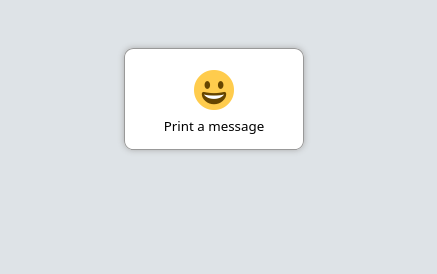
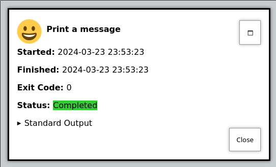
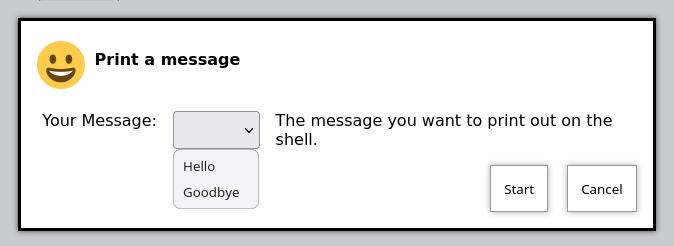

[#args]
== Arguments 

=== Introduction to Arguments

Actions and commands that OliveTin runs, without arguments, are generally quite safe - only that command can be run, without modifications. However, many users need the flexibility to set options on that command - normally called command line arguments. In OliveTin, arguments are defined in a shell commands like `echo {{ message }}`, with a bit of extra configuration.

Examples of valid argument names are `{{ personName }}`, `{{ customer_number }}` and `{{ ISBN11_code }}`. 

* a-z (case insensitive)
* _ is allowed
* numbers are allowed (argument names can also start with numbers)
* all other characters are invalid for argument names.

=== Important Safety Warning

Before you continue, it's important to read through this safety warning. 

OliveTin supports customization of command line arguments, but there is a element of risk. For example, if your command is `echo {{ message }}`, and you allow your users to set `{{ message }}` to the value `"" && rm -rf /` , then you've got real problems. For this reason, OliveTin tries to give you useful ways to restrict what users are allowed to enter - with **argument types**. 

However, here are some important rules to try and follow with argument types;

* Use the most restrictive argument types when possible - `ascii` and `int`. This will stop users entering argument values that might be used dangerously, but it's not foolproof. For example, if you have a command like `createSnapshot.sh --count {{ snapshotCount }}`, and set `snapshotCount` to `int`, then at least users will only be able to enter integer numbers. However, nothing stops them entering crazy values like 9999. 
* Don't give access to actions with arguments to people you don't trust. Please don't ever put your OliveTin install on the public internet! 

=== Textbox arguments

Many times you need to customize how an action/shell command is run, with arguments. For example;

----
echo "Hello world"
----

In the example above, `Hello world` is an argument passed to the `echo` command. OliveTin allows you to add pre-defined, and free-text arguments to commands in this way. Below is the OliveTin version of the `echo` command shown above;

----
actions:
  - title: echo a message
    icon: smile
    shell: echo {{ message }}
    arguments:
      - name: message
        type: ascii_sentence
----

This will give you a normal button, like this;

However, when you click on it, you'll get a prompt to enter arguments, like this;

image::images/args2.png[]

You'll see that the type is set to `ascii_sentence`. This applies fairly safe
input validation to arguments, so that only a-z, 0-9, spaces and .'s are allowed. 

When you start the action, and it's finished, go to the "logs" view to view the output of the command we've just run.

==== Argument types

A full list of argument types are below;

.Argument types reference table
[%header,cols="1,2"]
|===
| Type                        | Allowed values
| very_dangerous_raw_string   | Anything. This is **incredibly dangerous**, as effectively people can type anything they like, including executing additional commands beyond what you specify. Absolutely should not be used unless your OliveTin instance can only be used by people you trust entirely.
| int                         | Any number, made up of the characters 0 to 9. Negative numbers are not supported.
| ascii                       | a-z (case insensitive), 0-9, but no spaces or punctuation
| ascii_identifier            | Like a DNS name, a-Z (case insensitive), 0-0, `-`, `.`, and `_`. 
| ascii_sentence              | a-z (case insensitive), 0-9, with spaces, `.` and `,`. 
| url                         | A url, e.g. https://github.com/OliveTin
|===

=== Dropdown choice arguments

Predefined choices are normally the safest type of arguments, because users are limited to only enter values that you specify. 

----
actions:
  - title: echo a message
    icon: smile
    shell: echo "{{ message }}"
    arguments:
      - name: message
        choices:
          - title: Hello
            value: Hello there!

          - title: Goodbye
            value: Aww, goodbye. :-( 
----

Note that when predefined choices are used, the argument type is ignored.

This is what it looks like in the web interface;

Then finally, when you execute this command, it would look something like this (remember that this is just a basic "echo" command). 

image::images/args-choices-exec.png[]

