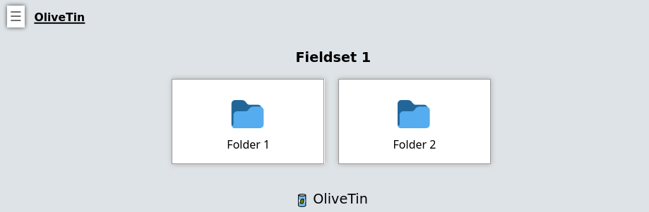

[#dashboards]
== Dashboards

OliveTin generates a default view of actions which is useful for simple OliveTin use cases - this is always called "Actions" and cannot be renamed. The Actions view also does not support entities, fieldsets or folders.

If you want to start organizing OliveTin actions more effectively, then **Dashboards** are for you!

image::images/dashboard.png[]

Example configuration

[source,yaml]
.`config.yaml`
----
# Actions MUST be defined in the actions section, not in the dashboards
# section. The dashboards only "link" to actions by their title.
actions:
 - title: Ping All Servers
   shell: echo "ping all..."

 - title: '{{ server.name }} Wake on Lan'
   shell: 'wol {{ server.name }}'
   timeout: 10

 - title: '{{ server.name }} Power Off'
   shell: 'ssh root@{{ server.name}} "poweroff"'
   timeout: 10

# Dashboards are a way of taking actions from the default "actions" view, and
# organizing them into groups - either into folders, or fieldsets.
#
# The only way to properly use entities, are to use them with a `fieldset` on
# a dashboard.
dashboards:
  # Top level items are dashboards.
  - title: My Servers
    contents:
      # On dashboards, all items need to be in a "fieldset". If you don't 
      # specify a fieldset, actions will be assigned to a fieldset with a title
      # called "default".
      - title: All Servers
        type: fieldset
        contents:
        # The contents of a dashboard will try to look for an action with a
        # matching title IF the `contents: ` property is empty.
        - title: Ping All Servers

        # If you create an item with some "contents:", OliveTin will show that as
        # directory.
        - title: Hypervisors
          contents:
            - title: Ping hypervisor1
            - title: Ping hypervisor2

      # If you specify `type: fieldset` and some `contents`, it will show your
      # actions grouped together without a folder.
      - type: fieldset
        entity: server
        title: 'Server: {{ server.hostname }}'
        contents:
          # By default OliveTin will look for an action with a matching title
          # and put it on the dashboard.
          #
          # Fieldsets  also support `type: display`, which can display arbitary
          # text. This is useful for displaying things like a container's state.
          - type: display
            title: |
              Hostname: <strong>{{ server.name }}</strong>
              IP Address: <strong>{{ server.ip }}</strong>

          # These are the actions (defined above) that we want on the dashboard.
          - title: '{{ server.name }} Wake on Lan'
          - title: '{{ server.name }} Power Off'
----

=== The "actions" section

To make Olivetin easy to use, it generates a default "Actions" section for you, as many 
people don't want the hassle of having to configure dashboards. This is fine, you absolutely
do not need a `dashboards:` section in your `config.yaml` at all if you don't want it.

However, some people prefer to put every action onto a Dashboard. If you so this, OliveTin
will hide the `Actions` view for you on the sidebar.

[#fieldsets]
=== Fieldsets

It is possible to group actions together in a "group", which is not a directory, but is called
a "fieldset". This is an example of a fieldset that contains two <<folders,folders>>.

Fieldsets are defined under a <<dashboards,dashboards>> in your config.yaml.

.`config.yaml`
[source,yaml]
----
dashboards:
  - title: My First Dashboard
    contents:
      - title: Fieldset 1
        type: fieldset
        contents: []

      - title: Fieldset 2
        type: fieldset
        contents: []
----

Fieldsets are also generated for you when you use <<entities,entities>>.

.`config.yaml`
[source,yaml]
----
dashboards:
  - title: My First Dashboard
    contents:
      - title: Fieldset 1
        type: fieldset
        entity: server
        contents:
          - title: Start {{ server.Name }}
          - title: Shutdown {{ server.Name }}
----

[#folders]
=== Folders (Directories)

Folders (Directories) are a good way to group up actions in the same way that you would
organize files on your computer into directories.

You must first create a dashboard to use a directory, and then you "reference" actions that you
want in that folder based on the action name. Anything without a "contents" property is treated
as an action.

Let's look at the example below with 4 actions, 2 top level folders and 1 subfolder.

.`config.yaml`
[source,yaml]
----
actions:
  - title: Action 1
    shell: echo "action1"

  - title: Action 2
    shell: echo "action2"

  - title: Action 3
    shell: echo "action3"

  - title: Action 4
    shell: echo "action4"

dashboards:
  - title: My First Dashboard
    contents:
      - title: Fieldset 1
        type: fieldset
        contents:
          - title: Folder 1
            contents:
              - title: Action 1
              - title: Action 2

              - title: Subfolder 2
                contents:
                  - title: Action 3

          - title: Folder 2
            contents:
              - title: Action 4

----

[#displays]
=== Displays

Displays are most commonly used with entities, but they can contain any HTML, including variables as well.

image::images/dashboard-display.png[]

[source,yaml]
.`config.yaml`
----
dashboards:
  # This is the second dashboard.
  - title: My Containers
    contents:
      - title: Container {{ container.Names }}
        entity: container
        type: fieldset
        contents:
          - type: display
            title: |
              {{ container.Names }}   <strong>{{ container.State }}</strong>
          - title: 'Start {{ container.Names }}'
          - title: 'Stop {{ container.Names }}'
----

[#output-views]
=== Most recent action output

This is considered an advanced and experimental feature at the moment. 

WARNING: If you execute too frequently (like every 5-10 seconds) OliveTin is prone to crashing. This will be fixed later.

WARNING: If you are running a status command, you should use `execOnStartup` and `execOnCron` to make sure it is ready for when the webui loads, or OliveTin is likely to crash.

----

actions:
  - title: Get status
    id: status_command
    shell: date
    execOnStartup: true
    execOnCron:
      - "*/1 * * * *"

dashboards:
  - title: Control Panel
    contents:
      - title: Status
        type: fieldset
        contents:
          - type: stdout-most-recent-execution
            title: status_command
