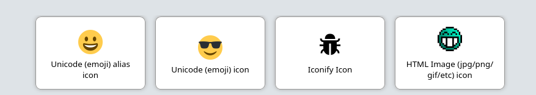
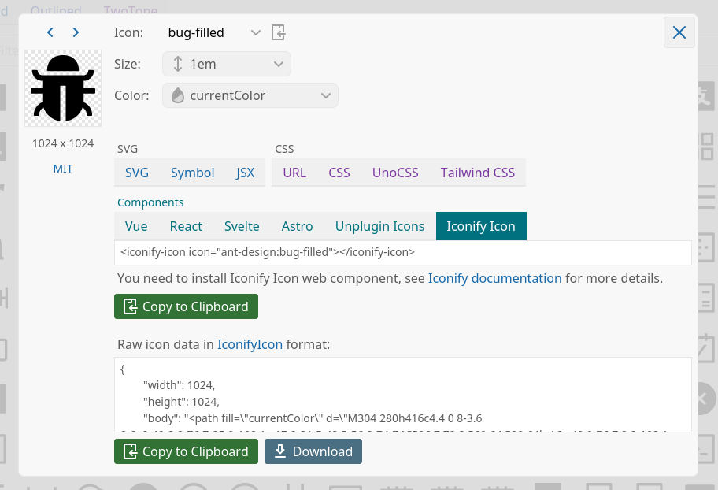
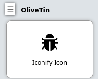
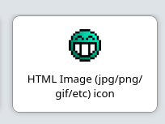

[#icons]
=== Icons

You can specify any HTML for an icon. It's a popular choice to use Unicode
icons because they are extremely fast to load and there are a lot of them, 
but OliveTin also support Iconify, and just images. 

.Examples of icons in OliveTin


For a quick reference, here are some examples of how to use different types of icons in OliveTin;

.`config.yaml`
```yaml
include::../configs/icons/config.yaml[]
```

==== Iconify Icons

Browse over 200,000 icons that can be used with OliveTin here; https://icon-sets.iconify.design/

Note, the icons are loaded from the internet, but should be cached by your browser afer the first load.

On the Iconfiy website, you should select **Iconify Icon**



Then copy this icon code, and place it in your config;

[source,yaml]
.`config.yaml`
----
actions:
  - title: Iconify Icon
    icon: <iconify-icon icon="ant-design:bug-filled"></iconify-icon>
----

And you should get something that looks like this;



==== Unicode icons ("emoji")

For example on the link:https://symbl.cc/en/emoji/[here is a list of
"Emoji" in unicode]. If you find "link:https://symbl.cc/en/1F60E/[Smiling face with sunglasses]" you can click 
on it to see it's "HTML-code". In OliveTin, you'd setup the icon like this;

----
actions:
  - title: Unicode (emoji) icon
    icon: "&#128526;"
    shell: echo "You are awesome"
----

==== Full HTML icons (`'
      shell: docker ps
----

NOTE: This full HTML thing is very customizable, but easier options will
probably be added in the future as well. 

==== Saving and serving icons for "offline" use

Sometimes you might want to store images to use as icons, with your installation of OliveTin. This can be useful when your installation is meant to be offline, or disconnected from the internet. This is easily done.

OliveTin will try to create a directory called `custom-webui` in the same directory as the `config.yaml` file. If this directory exists, OliveTin will serve files from this directory as if they were in the standard webui directory, at `/customIcons/`.

Ideally, put your icons in a new `<your-config-dir>/custom-webui/icons/`. Below is a picture of Mr Green. Feel free to save his likeness and awesomeness for yourself, for future awesome offline usage.

.Mr Green, the original awesome smily.


In your OliveTin config, customize your command again using HTML, like this;

----
actions:
    - title: Mr Green
      icon: ''
      shell: echo "I don't like the word 'emoji' "
----

This will result in a locally hosted icon that will work offline, that looks like this;



////
=== CSS styles

OliveTin allows you to write any CSS style rules directly on a single action.
This is both pretty powerful if you want an action to have a particular style,
but it does require understanding that you are writing your code - and can
break things! Be careful!

A tutorial on how to use CSS can easily be found online, but here are some
examples;

==== Example: Bold & Purple action

----
- actions:
    - title: My special action
      css:
        background-color: purple
        font-weight: bold
      shell: echo "I like purple"
----
////


