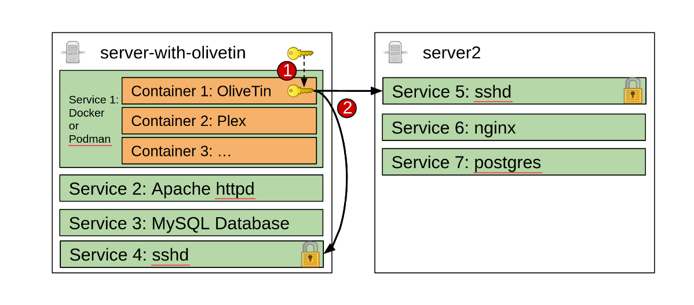

[#action-ssh-easy]
=== SSH (easy setup)

include::ssh_snippit_intro.adoc[]

NOTE: This is the easy method of setting up SSH with OliveTin - this generates a new SSH key for you, and a configuration file that disables SSH host key checking, to make it faster to do useful things with OliveTin. This is fine for most homelab setups, but if you are using OliveTin in a production environment, you should use the more secure method of setting up SSH and set it up manually, see <<action-ssh,SSH (manual setup)>>.

==== SSH from inside a Container - setup instructions

* [red]#<<ssh-easy-step-1,Step 1>># Use the olivetin-setup-easy-ssh script to generate a new SSH key and configuration file
** Add this key fingerprint to servers and hosts that you want to SSH to.
* [red]#<<ssh-easy-step-2,Step 2>># Setup actions that use SSH with this configuration file (which points to the key)

Visually, this is what it looks like - OliveTin is running in the (orange) container, and then can either connect back to _server-with-olivetin_ or _server2_.



[#ssh-easy-step-1]
==== [red]#Step 1#: Run the olivetin-setup-easy-ssh script

Setup an action as follows, to use the builtin olivetin-setup-easy-ssh script that comes with OliveTin containers. This script does **not** work on Windows, MacOS, or outside of a container.

.config.yaml
[source,yaml]
```
actions:
  - title: Setup SSH
    shell: olivetin-setup-easy-ssh
    popupOnStart: execution-dialog
```

[#ssh-easy-step-2]
==== [red]#Step 2#: Use the configuration file in your actions

To use the configuration file generated by the script, you can use the following in your other actions:

.config.yaml
[source,yaml]
```
actions:
  - title: SSH into a server
    shell: ssh -F /config/ssh/config root@myserver '/opt/script-on-my-server.sh'
```
