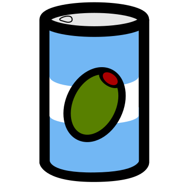

= OliveTin 
:docinfo: shared
:doctype: book
:title: OliveTin documentation
:toc: left
:toclevels: 2
:sectanchors:
:sectlinks:
:multipage-level: 2
:favicon: images/icons/OliveTinLogo.png
:source-highlighter: rouge

toc::[]

include::intro.adoc[]

include::install/index.adoc[]

include::config.adoc[]

include::reverse-proxies/index.adoc[]

include::action_execution.adoc[]

include::action_customization.adoc[]

include::action_examples/index.adoc[]

include::args.adoc[]

include::dashboards.adoc[]

include::entities.adoc[]

include::integrations/index.adoc[]

include::security/index.adoc[]

include::solutions/index.adoc[]

include::advanced_configuration.adoc[]

include::reference/index.adoc[]

include::troubleshooting.adoc[]

include::api.adoc[]

