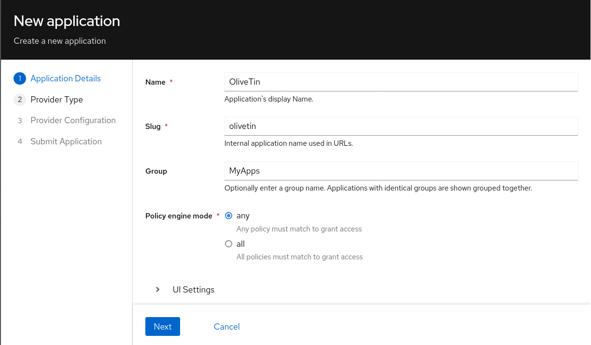
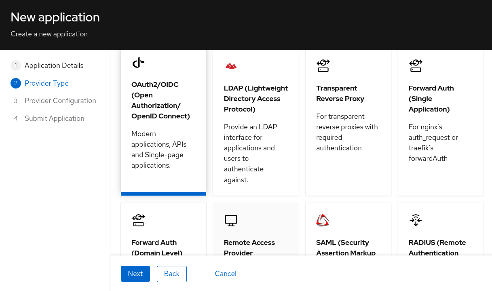
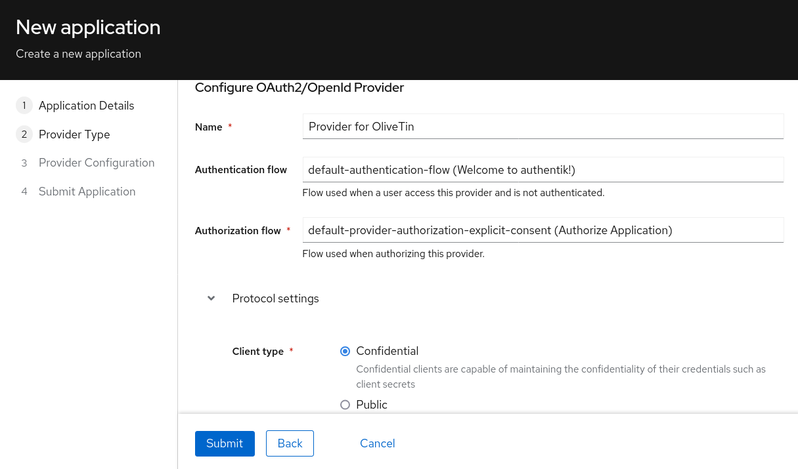
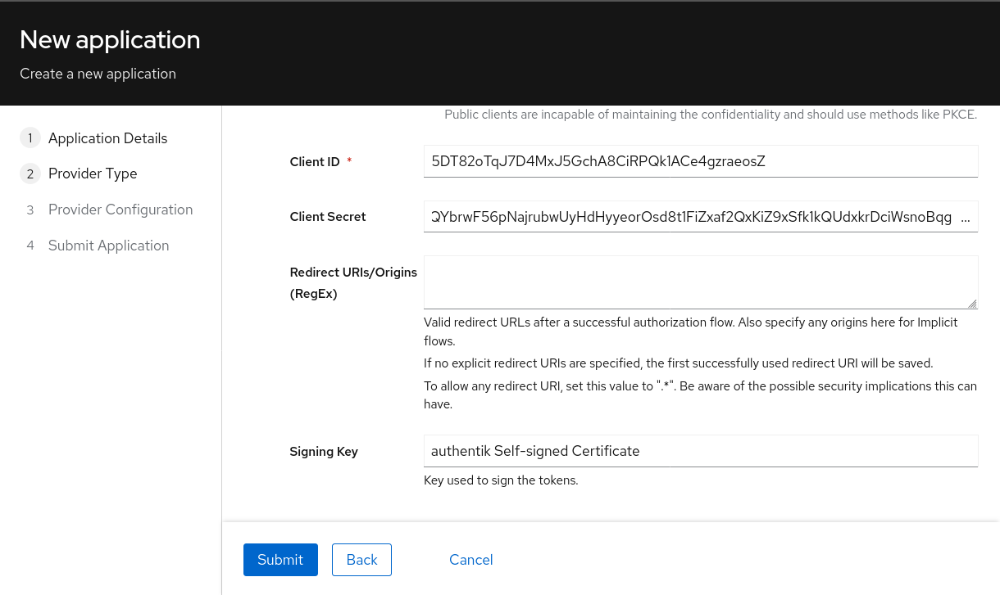

[#oauth2-authentik]
=== OAuth2 - Authentik

OliveTin has been tested with Authentik. This documentation page describes how to configure Authentik for use with OliveTin and assumes you already have Authentik installed and running.

Login as an Authentik administrator and start by creating a new app as follows;



Click Next, and on the **Provider Type** page select **OAuth2**.



Click Next, and on the **Provider Configuration** page, fill in the following fields;



Scroll down, and on the same page, copy the **Client ID** and **Client Secret** fields. You will need these to configure OliveTin.



Submit this wizard to save the configuration.

==== Group Mapping

As of OliveTin `2024.11.24`, one group can be processed from OAuth at login. To map a user's groups to OliveTin from Authentik, there are a few options. Examples of two will be shown below.

===== First Prefix Match

The below will match the first group the user is a member of that matches the prefix defined in `group_prefix`, which is set to `olivetin`. If no match is found, the group `guest` is returned by default. Both `group_prefix` and `returned_group` can be changed to your needs.

In Authentik: `Admin Interface > Customization > Property Mappings > Create > Scope Mapping`

- Name: `olivetin-group-mapping`
- Scope Name: `olivetin-group-mapping`
- Description: `map first group that starts with "olivetin"`
- Expression:
```python
group_prefix = "olivetin"
returned_group = "guest"

groups = [group.name for group in user.ak_groups.all()]

for group in groups:
    if group.startswith(group_prefix):
        returned_group = group
        break

return {
    "olivetin_group": returned_group
}
```

===== Specific Group Match

The below will match the specified group name to one of the groups the user is a member of. If no match is found, the group `guest` is returned by default. Both `olivetin_group` and `returned_group` can be changed to your needs.

In Authentik: `Admin Interface > Customization > Property Mappings > Create > Scope Mapping`

- Name: `olivetin-group-mapping-specific`
- Scope Name: `olivetin-group-mapping-specific`
- Description: `search and map specified group for olivetin`
- Expression:
```python
olivetin_group = "olivetin-users"
returned_group = "guest"

groups = [group.name for group in user.ak_groups.all()]

if olivetin_group in groups:
    returned_group = olivetin_group

return {
    "olivetin_group_specific": returned_group
}
```

===== Enable Group Mapping

After creating the scope mapping in Authentik, you will need to add it to your provider. For the your OliveTin config, use the `userGroupField` mentioned in the following section.

In Authentik: `Admin Interface > Applications >  Providers > {Your Provider} > Edit`

- Open `Advanced protocol settings`
- Under `Scopes`, add `your_scope_map` to `Selected Scopes`
- Click `Update`

==== OliveTin configuration

The necessary OliveTin configuration is as follows:

```yaml
authRequireGuestsToLogin: true # Optional - depends if you want to "disable" guests.

authOAuth2RedirectURL: "http://localhost:1337/oauth/callback"
authOAuth2Providers:
  authentik:
    name: authentik
    title: Authentik
    clientID: "1234567890"
    clientSecret: "123456789012345"
    authURL: "http://localhost:9000/application/o/authorize/"
    tokenURL: "http://localhost:9000/application/o/token/"
    whoamiURL: "http://localhost:9000/application/o/userinfo/"
    usernameField: "preferred_username"
    icon: <iconify-icon icon="simple-icons:authentik"></iconify-icon>
```

Optional configuration values to consider are:
```yaml
authOAuth2Providers:
  authentik:
    userGroupField: "your_mapped_group_name"
    certBundlePath: "/path/to/mounted/certificate.pem"
    insecureSkipVerify: true
    connectTimeout: 15
```

You will need to restart OliveTin for the changes to take effect.

==== Testing

You should now be able to login to OliveTin using Authentik, on the OliveTin page, a "Login" link should be available in the top right corner. This will take you to the login form, where you can select the Authentik provider.


==== Debugging

OliveTin logs OAuth2 flows quite extensively. If you are having trouble with OAuth2, you should check your OliveTin logs. 

==== Next steps

Once you have OAuth2 working, you will probably want to configure access control lists in OliveTin. This is described in the <<acls,Access Control Lists>> documentation page.

